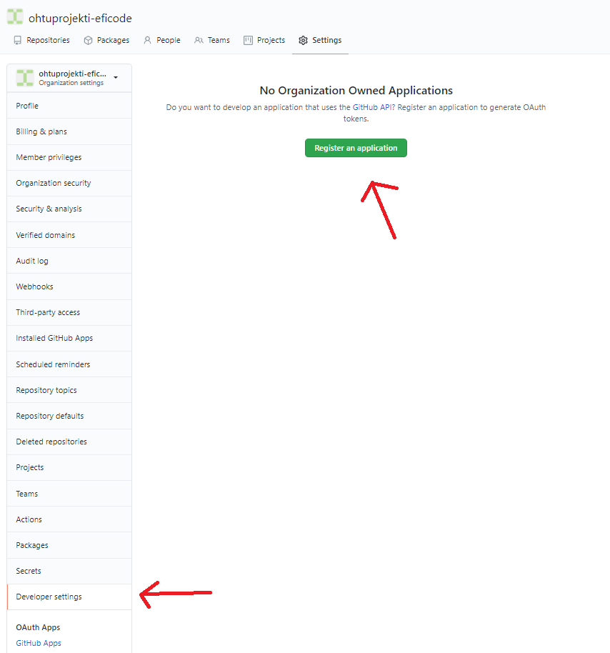
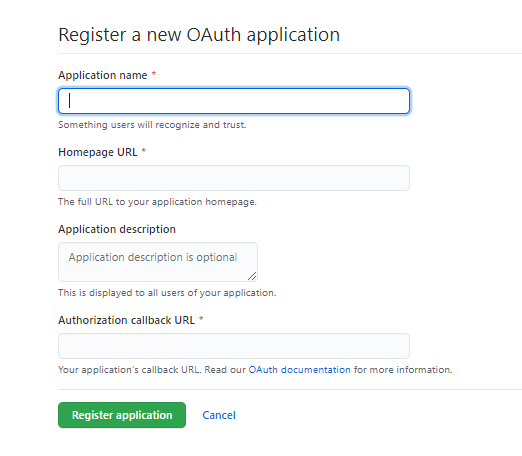
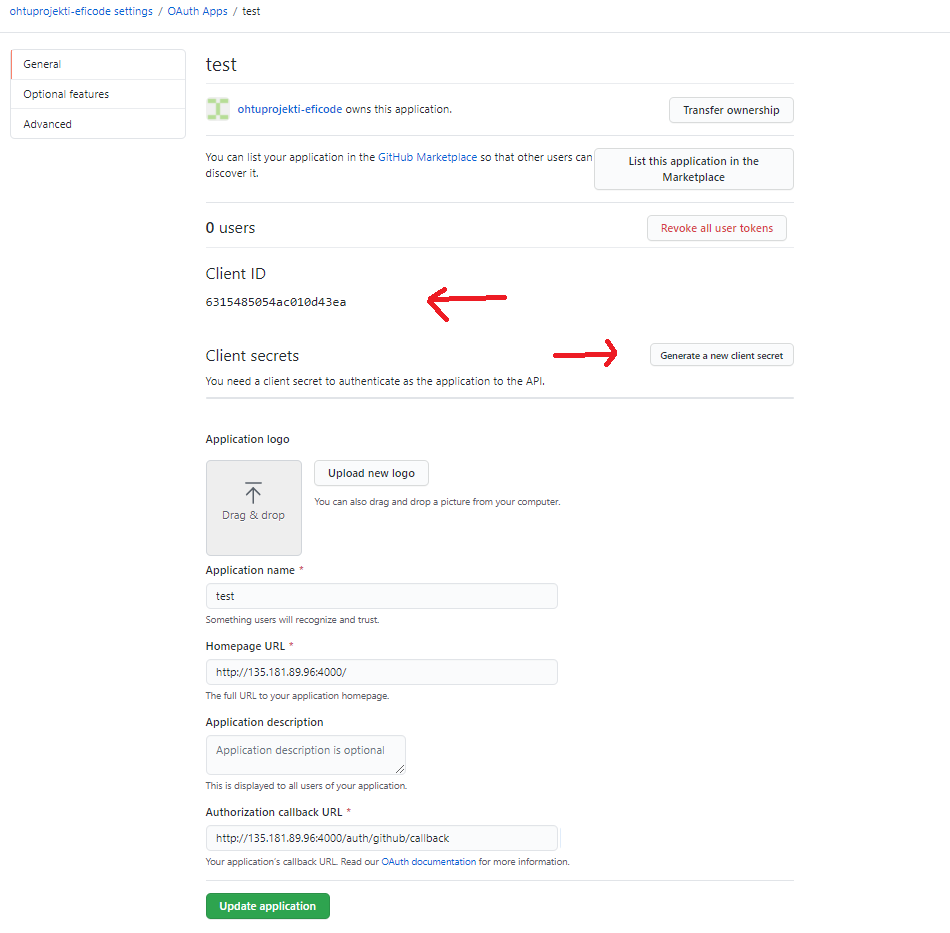
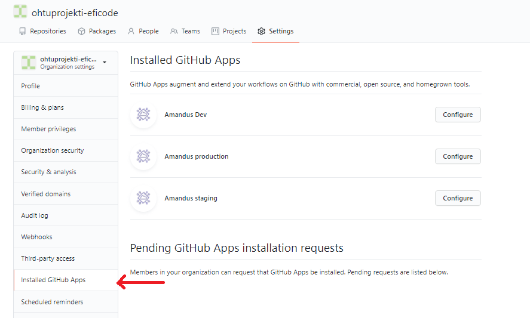
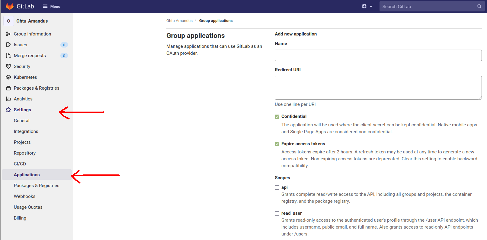
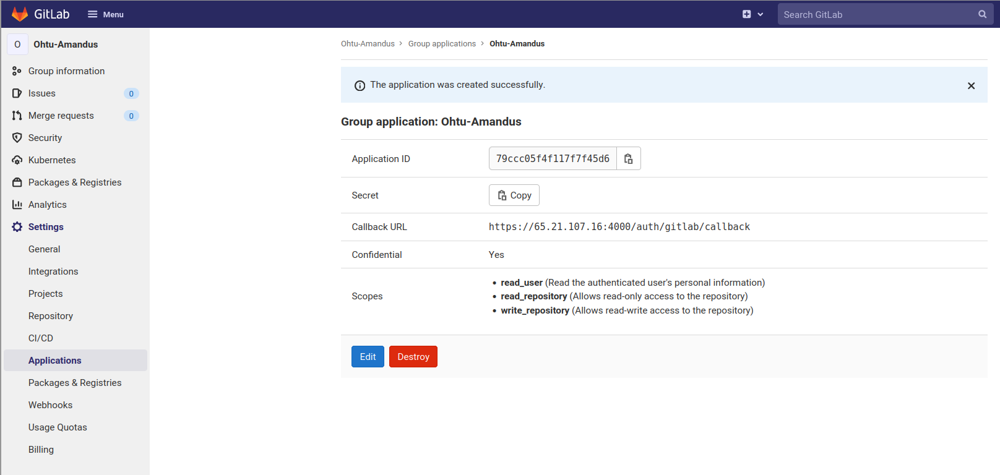
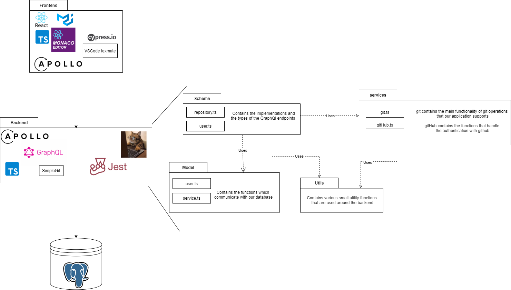

# General documentation

## Setting up a Github application

The application has a feature to fetch user details and an authorization tokens from Github, GitLab and BitBucket. This requires settings up corresponding applications and configuring them correctly. The procedures are as follows:

1. Navigate to your personal or organization settings and find the `developer settings` to register a new application.

2. Fill in the details. The `callback url` is the most important part here and we set it to `http://135.181.89.96:4000/auth/github/callback` because our application is running at `http://135.181.89.96:4000/`

3. Once you create the application, you are redirected to the configuration page. Here you need to create a client secret and also copy your client id.

4. Now you're done. You can also access the settings after creation by navigating to `Installed Github apps`

5. The application has environment values `GH_CLIENT_ID`, `GH_CLIENT_SECRET` & `GH_CB_URL`. These are the client id, client secret and callback url from your newly created app. The [backend documentation](backend.md) has more information regarding the environment values required.

## Setting up a GitLab application

1. Head over to GitLab and navigate to the settings. GitLab application can be created by using group or personal account.

2. Application details

- Fill in the application name and redirect uri. In this case `redirect uri` is `https://65.21.107.16:4000/auth/gitlab/callback` because our application is currently running that address. For local development use `http://localhost:3000/auth/gitlab/callback`.
- From the scope list you should check `read_user`, `write_repository` and `read_repository` which will give the necessary authorization for the application to perform actions on user's behalf.

3. Once you have clicked 'Save application' you are given values which will be used to identify your application with GitLab.

4. These are environment values for `GL_CLIENT_ID`, `GL_CLIENT_SECRET` and `GL_CALLBACK_URL`. Please refer to [backend documentation](backend.md) how to set them up.

## Running the application locally for development

#### Without docker-compose

- Follow the instructions in [frontend documentation](frontend.md) and [backend documentation](backend.md) to start the services individually
- Remember to also setup a `postgresql` database and configure the backend's `DATABASE_URL` accordingly

#### With docker-compose

1. Setup the correct backend environment values as described in [backend documentation](backend.md)
2. Run `yarn` in both `/frontend` & `/backend` folders
3. Run `sudo docker-compose build`
4. Run `sudo docker-compose up`
   - Sometimes the backend fails to start during the first run due to `postgresql` not starting fully before migrations run. Restarting this a couple of times has always fixed the issue.
5. The application should be viewable in `localhost:3000` and the graphlql playground at `localhost:3001/graphql`
   - Hot-reload is configured and the application uses your local `node_modules`
6. Running `sudo docker-compose down --volumes` shuts down the application and clears the database

## Running the application in production

The production version is ran with the `Dockerfile` found in the root of this repository. The easiest way to use it with our `docker-compose.server.yml`, also found in the root. The `docker-compose.server.yml` has placeholders for all the environment values required. It also has `docker/watchtower` configuration in place. This is not vital if you do not wish to use it for automatic updating of the image from `dockerhub`.

### Fastest way to get the application running by pulling from dockerhub

1. Fill the environment values in `docker-compose.server.yml` as described in [backend documentation](backend.md)
2. Fill in the desired ports
3. Change the `image: ''` placeholder to `image: ohtuprojekti/wevc:application-production`. This pulls the production tag from [our dockerhub](https://hub.docker.com/r/ohtuprojekti/wevc). Github actions builds and pushes this image when the `master` branch is updated.
4. Run `sudo docker-compose -f docker-compose.server.yml up` to start the application to the port you configured
   - Sometimes the application fails to start during the first run due to `postgresql` not starting fully before migrations run. Restarting this a couple of times has always fixed the issue.
5. Running `sudo docker-compose -f docker-compose.server.yml down --volumes` shuts down the application and clears the database

### Build the production version locally and run it

1. Fill the environment values in `docker-compose.server.yml` as described in [backend documentation](backend.md)
2. Fill in the desired ports
3. Change the `image: ''` to `build: .`
4. Run `sudo docker-compose -f docker-compose.server.yml build` to build the `Dockerfile`
5. Run `sudo docker-compose -f docker-compose.server.yml up` to start the application to the port you configured
   - Sometimes the application fails to start during the first run due to `postgresql` not starting fully before migrations run. Restarting this a couple of times has always fixed the issue.
6. Running `sudo docker-compose -f docker-compose.server.yml down --volumes` shuts down the application and clears the database

### CI/CD
CI/CD is handled with [GitHub Actions](https://docs.github.com/en/free-pro-team@latest/actions). Our GitHub Actions workflow configurations can be found [here](../.github/workflows). Our deployment configuration is described better in [summary document](../documentation/summary.md#deployment-to-production).

### Package diagram

